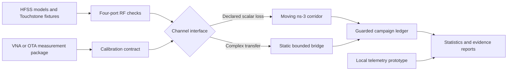

<p align="center">
  
</p>

<p align="center">
  <a href="https://github.com/Devchandrasen/Velocity-Connect/actions/workflows/implementation-ci.yml"></a>
  
  
  
  
</p>

<p align="center">
  <strong>Electromagnetics, railway mobility, and reproducible evidence in one research stack.</strong>
</p>

<p align="center">
  <a href="#quick-start">Quick start</a> ·
  <a href="docs/architecture.md">Architecture</a> ·
  <a href="docs/how-to-run-a-campaign.md">Run a campaign</a> ·
  <a href="RESULTS.md">Evidence ledger</a> ·
  <a href="REPRODUCIBILITY.md">Reproduce</a>
</p>

## What is Velocity Connect?

Velocity Connect is a research implementation for studying a passive
roof-to-cabin RF feedthrough for 5G NR connectivity in metallic high speed
railway coaches. It combines parameterized HFSS models, a four-port RF transfer
layer, ns-3/5G-LENA mobility experiments, guarded campaign orchestration, and a
local measurement prototype.

The project is deliberately evidence-gated. Software tests, electromagnetic
solver outputs, packet simulations, and physical measurements are kept as
separate evidence classes. A successful test at one layer is never promoted
into a hardware or railway deployment claim.

## Why this project exists

Metal coaches can attenuate outdoor cellular signals, while high train speed
compresses the time available for cell transitions. A passive feedthrough may
improve the RF path without an active onboard repeater, but its value depends on
the complete installed loss and the moving network response. Velocity Connect
provides the tools to test that chain without hiding failed runs or unresolved
physical checks.

| Layer | What the repository provides |
|---|---|
| Electromagnetics | Parameterized n78 antenna and four-port HFSS builders, compact Touchstone fixtures, passivity checks, and power-budget audits |
| Network simulation | A pinned ns-3.48 and 5G-LENA v5.0 railway corridor with downlink, uplink, A3/X2 handover, load, and loss sensitivity controls |
| EM-to-network bridge | A bounded static complex-transfer interface with explicit external coupling operators and fail-closed geometry checks |
| Experiment control | Frozen run identities, append-only ledgers, resource admission, no silent retries, and confidence-interval analysis |
| Measurement path | VNA/OTA calibration contracts and a localhost paired baseline/passive telemetry prototype |

## System architecture



The moving railway campaign currently uses declared reciprocal scalar-loss
hypotheses. The complex four-port bridge is a separate static interface. See
[Architecture](docs/architecture.md) for the boundary between them.

## Current evidence status

| Evidence gate | Status | Supported interpretation |
|---|---|---|
| CPU implementation suite | Pass locally; repeated by GitHub Actions on every pull request | Campaign construction, RF algebra, calibration validation, ledgers, statistics, and prototype behavior are executable |
| Byte-level source manifest | Pass: 150 files | Reviewed implementation inputs and compact fixtures can be checked for drift |
| Transaction-v3 network campaign | Pass | 30 terminal ledgers contain 816 successful scalar-hypothesis simulation runs |
| Static complex EM bridge | Pass with boundary | Solved four-port coefficients can drive a static single-stream interface with explicit external operators |
| HFSS radiator power closure | Failed physical gate | Native radiation efficiency remains above 100 percent; absolute gain and efficiency claims are excluded |
| Fabricated coach installation | Open | No VNA, chamber, installed-coach, route-calibrated, or moving-train validation is claimed |

The detailed record, including retained failures, is in [RESULTS.md](RESULTS.md).

## Quick start

### 1. Validate the implementation

Windows PowerShell:

```powershell
git clone https://github.com/Devchandrasen/Velocity-Connect.git
Set-Location Velocity-Connect
py -3.12 -m venv .venv-reproduction
.\.venv-reproduction\Scripts\python.exe -m pip install -r environment\requirements-lock.txt
.\.venv-reproduction\Scripts\python.exe scripts\verify_source_manifest.py
.\.venv-reproduction\Scripts\python.exe -m pytest -q
```

This path does not require ns-3 or HFSS. It validates the software and retained
fixtures only.

### 2. Launch the local research prototype

Terminal 1:

```powershell
.\.venv-reproduction\Scripts\python.exe -m prototype.velocity_connect.server
```

Terminal 2:

```powershell
.\.venv-reproduction\Scripts\python.exe prototype\demo_stream.py --samples-per-condition 20
```

Open [http://127.0.0.1:8765](http://127.0.0.1:8765). The bundled stream is
synthetic and exists only to demonstrate the measurement workflow.

For a guided walkthrough, read [Getting started](docs/getting-started.md).

## Reproduce the network campaign

The campaign runtime is pinned to Ubuntu 22.04, ns-3.48 commit
`d2add90b452d600cfb4859baed8e9ea633519447`, and 5G-LENA v5.0 commit
`47a3adc263f773556eaadac5a5341458dbc61c47`.

```bash
bash scripts/bootstrap_ns3_v5.sh "$HOME/ns-3.48-velocity-connect" "$PWD"
bash scripts/sync_wsl_ns3_v5.sh --run-tests \
  "$HOME/ns-3.48-velocity-connect" "$PWD"

cd "$HOME/ns-3.48-velocity-connect"
bash velocity_connect_tools/run_transaction_campaigns_v7.sh
```

Do not start the loss sweep until the principal campaign is terminal. The
complete sequence, expected row counts, output checks, and recovery rules are
in [How to run a guarded campaign](docs/how-to-run-a-campaign.md).

## HFSS and RF artifacts

The `hfss/` directory contains PyAEDT builders and native AEDT automation for:

- n78 dual-port antenna screening;
- installed radome variants;
- balanced and delayed four-port feedthroughs;
- field and terminal-source diagnostics; and
- fail-closed radiation power accounting.

Selected native `.aedt` projects and compact `.s4p` fixtures are committed for
inspection and software-level replay. HFSS re-solving requires a compatible
Ansys Electronics Desktop installation and licence. The current radiator
power discrepancy is preserved, not clipped or renamed as a valid efficiency.

## Repository map

```text
Velocity-Connect/
├── hsr_*.h, hsr_velocity_connect.cc   ns-3/5G-LENA simulation core
├── research_campaign.py               generic isolated campaign runner
├── scripts/                           pinned bootstrap, guarded runs, analysis
├── hfss/                              AEDT builders, audits, native projects
├── fixtures/hfss/                     compact solved four-port evidence
├── calibration/                       moving-link data admission contract
├── prototype/                         localhost telemetry collector and UI
├── reproducibility/                   protocols, status, and audit records
├── tests/                             CPU and bounded integration checks
└── docs/                              tutorial, how-to, reference, explanation
```

## Documentation

| Document | Use it when you want to |
|---|---|
| [Getting started](docs/getting-started.md) | reach a verified local result in a few steps |
| [Architecture](docs/architecture.md) | understand the data flow and design boundaries |
| [Experiment reference](docs/experiment-reference.md) | look up models, profiles, metrics, and command surfaces |
| [Run a guarded campaign](docs/how-to-run-a-campaign.md) | execute the pinned ns-3 workflow without mixing partial evidence |
| [Evidence model](docs/evidence-model.md) | determine which scientific claims each artifact can support |
| [Full reproducibility contract](REPRODUCIBILITY.md) | rebuild the exact analysis and simulator environments |
| [Experiment protocol](EXPERIMENT_PROTOCOL.md) | inspect the frozen scientific design |
| [Evidence ledger](RESULTS.md) | see completed checks, failures, and claim limits |

## Contributing

Changes are welcome when they preserve the evidence boundaries and failure
history. Read [CONTRIBUTING.md](CONTRIBUTING.md) before modifying campaign
identities, dependency pins, HFSS acceptance logic, or recorded results.

For research use, cite the repository URL together with the exact Git commit.
Publication-specific citation metadata will be added after the associated
manuscript record is finalized.
