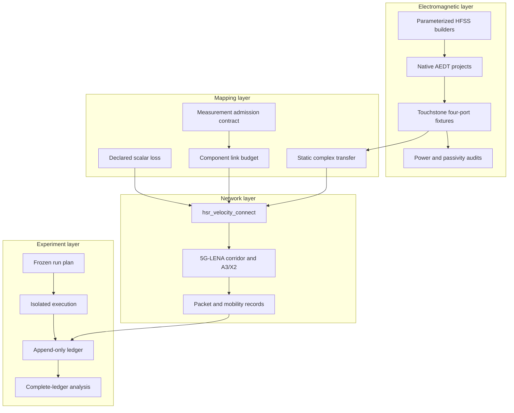

# Architecture

Velocity Connect separates five technical layers so a success in one layer
cannot silently become a claim about another. This separation is the central
design decision in the repository.

## End-to-end data flow

The declared scalar and component-budget paths can be used in moving corridor
experiments. The current complex-transfer path is intentionally static and
single-stream. It rejects motion, multiple links, missing external operators,
and unsupported geometry rather than substituting defaults.

## Layer 1: electromagnetic models

The `hfss/` directory contains builders and native automation for n78 antenna
screening and balanced/delayed four-port feedthroughs. The retained `.aedt`
projects are inspectable model artifacts. The compact `.s4p` files under
`fixtures/hfss/` let CPU tests validate reciprocity, passivity, mapping, and
differential delay without invoking a commercial solver.

`hfss/power_balance.py` uses independently exported power terms and explicit
field coordinates. It never clips efficiency. A loss-derived diagnostic cannot
override a failed accepted-to-radiated power check.

## Layer 2: RF-to-network mapping

`hsr_types.h` defines four passive models:

| Model | Purpose | Moving corridor support |
|---|---|---|
| `legacy_scalar` | retained historical fixed-loss behavior | yes |
| `declared_scalar` | predeclared total installed loss | yes |
| `component_budget` | feeder, coupling, indoor loss, and aperture terms | yes |
| `em_complex` | solved four-port transfer with external complex operators | static single run only |

`hsr_em_channel.h` implements standalone C++17 power-wave algebra. It does not
insert antenna gain or coupling defaults. The ns-3 adapter applies the selected
mapping to the radio path and rejects double counting.

## Layer 3: railway network simulation

`hsr_velocity_connect.cc` is the ns-3 entry point. The implementation is split
by concern:

| File | Responsibility |
|---|---|
| `hsr_types.h` | configuration, model enums, and validation |
| `hsr_nr.h` | NR helper, channel, scheduler, and device configuration |
| `hsr_handover.h` | A3/X2 trace collection |
| `hsr_apps.h` | packet applications and flow tracking |
| `hsr_stats.h` | summary statistics |
| `hsr_io.h` | machine-readable output |
| `hsr_runner.h` | one complete simulation execution |

The guarded corridor uses explicit gNB spacing, train speed, application
windows, update periods, handover parameters, and traffic direction. Every
single run writes its configuration alongside the measured outputs.

## Layer 4: campaign control

Two controllers serve different purposes:

- `research_campaign.py` builds general scenario, speed, distance, UE-count,
  seed, and run matrices. It isolates output directories and records failed
  attempts.
- `scripts/run_vehcom_validation.py` and
  `scripts/run_vehcom_revision06.py` enforce frozen identities, immutable plans,
  binary/source pins, resource limits, and no silent retry.

Campaign analysis runs only against complete, internally consistent ledgers.
Resource pilots and software smokes are stored separately from scientific
runs.

## Layer 5: measurement and prototype path

`calibration/measurement_contract.py` validates supplied measurement bundles,
their identifiers, byte hashes, units, passive bounds, and observation
coverage. It does not decide whether the measurements are authoritative or fit
a moving channel automatically.

The `prototype/` server collects paired baseline/passive telemetry in an
append-only local store. It is a lab workflow demonstrator, not a RAN controller
or production service.

## Design decisions

### Keep evidence classes separate

The project favors explicit boundaries over a seamless-looking demo. This
makes the workflow more verbose, but it prevents a unit test, synthetic stream,
or scalar loss sweep from being presented as a physical product result.

### Retain negative evidence

Failed and interrupted runs remain in ledgers. The HFSS power-closure failure
is stored as a replayable fixture. This costs repository space but makes claim
changes auditable.

### Pin external simulators

ns-3 and 5G-LENA are pinned by commit because helper behavior and regression
coverage change between releases. The cost is a stricter setup process. The
benefit is that a campaign cannot silently move to a different radio stack.

### Require explicit coupling

The complex bridge refuses to invent installed antenna, polarization, or cabin
operators. That prevents a convenient but unsupported EM-to-network claim.

## Related documents

- [Experiment reference](experiment-reference.md)
- [Evidence model](evidence-model.md)
- [Full reproducibility contract](../REPRODUCIBILITY.md)
- [Static EM bridge audit](../reproducibility/em_bridge_v1_audit.md)

[Back to the project overview](../README.md)
